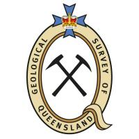

  

# GSQ Ontologies

The Geological Survey of Queensland publishes multiple [ontologies](https://en.wikipedia.org/wiki/Ontology_(information_science)) that define parts of GSQ's total data holdings.

The currently published ontologies are:

* **GSQ Geo Admin Features Ontology**
  * HTML: *coming!*
  * RDF (data): *coming!*
  * [repository](https://github.com/geological-survey-of-queensland/sweet-geological-features-profile-ont)
* **GSQ Geological Administrative Features Ontology**
  * HTML: <http://linked.data.gov.au/def/geoadminfeatures>
  * RDF (data): <http://linked.data.gov.au/def/geoadminfeatures.ttl>
  * [repository](https://github.com/geological-survey-of-queensland/geoadmin-features-ont)
  
  A machine-readable list of ontologies is also available at [register.json](register.json).
  
### Further Documentation
More information about GSQ's ontologies overall is available within [the wiki of this repository](https://github.com/geological-survey-of-queensland/ontologies/wiki). Included is GSQ's ontology publication processes and descriptions of the relationship between ontologies and vocabularies.
  
See the individual ontology's repos for information about them.

## Contacts
*Ontologies owner*:  
**Mark Gordon**  
Geological Survey of Quensland  
Department of Natural Resources, Mines and Energy  
Brisbane, QLD, Australia  
<mark.gordon@dnrme.qld.gov.au>  

*GSQ Data Mananger*:  
**Vance Kelly**  
Geological Survey of Quensland  
Department of Natural Resources, Mines and Energy  
Brisbane, QLD, Australia    
<vance.kelly@dnrme.qld.gov.au>  

*Author & Ontology specialist*:  
**Nicholas Car**  
[SURROUND Australia Pty Ltd](https://surroundaustralia.com)  
<nicholas.car@surroundaustralia.com>
