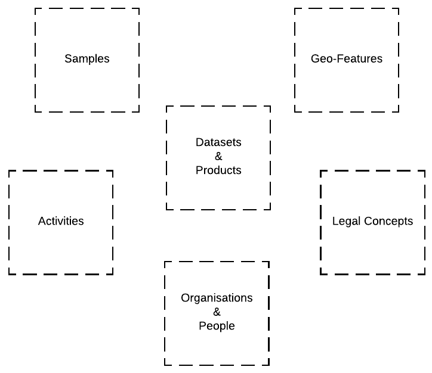
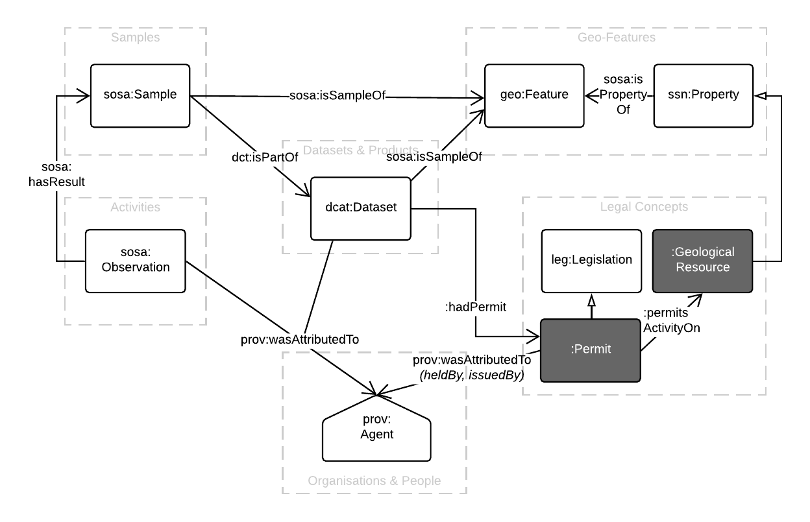
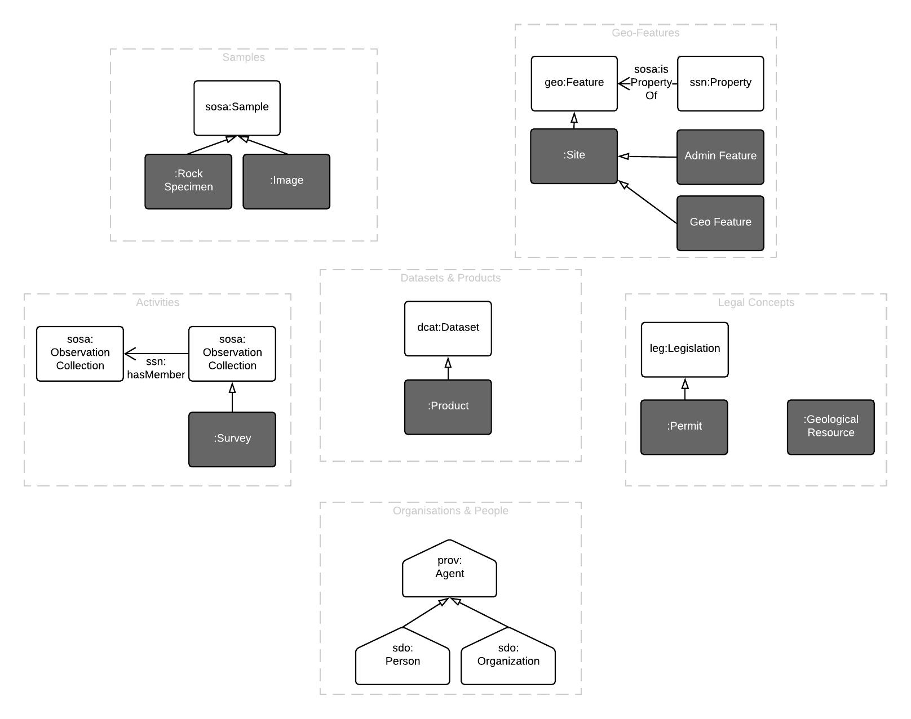
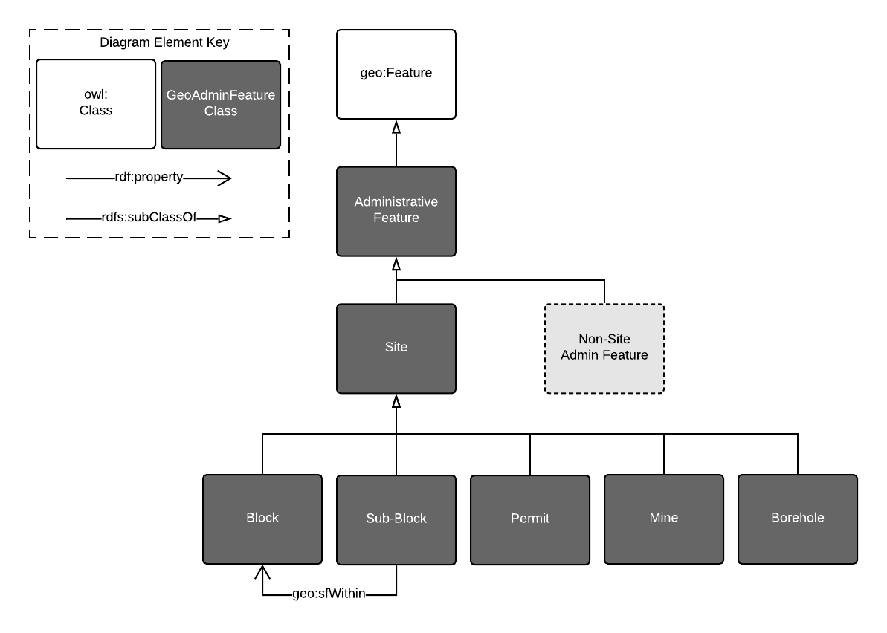

# Ontology Modelling

All of GSQ's ontologies fith within a framework that places them in relation to one another and also in relation to "upper" ontologies, that is, abstract ontologies that form the generalised patterns for information that specialised ontologies, of the form GSQ produces, then implement.

All future GSQ ontologies should fit within this framework, or alter it to cover missing areas of information.

### Domains

The major concerns of GSQ's modelling framework are *Domains* and they are show in Figure 1.

  
**Figure 1**: GSQ's Domains of modelling 

### Core Classes

Within each domain, GSQ uses standard international models for core concepts. These are all OWL models with Classes & Properties defined fomrally. Figure 2 showns both the Core Classes within Domains and the main properties that link them.

  
**Figure 2**: Core Classes within GSQ's Domains of modelling

The prefixes in Figure 2 (i.e. `sosa` in `sosa:Sample`) are short codes for indicating well-known models. Descriptions of all profixes in Figure 2 are given in Table 1 below.

**Table 1**: Prefixes used in Figure 2 and throughout this document.  

**Prefix** | **Namespace** | **Title** | **Decription**
--- | --- | --- | --- 
dct | <http://purl.org/dc/terms/> | Dublin Core Terms | The [Dublin Core Metadata Initiative](https://www.dublincore.org/)'s general purpose properties for library-style resources (books, digital data etc.)
dcat | <http://www.w3.org/ns/dcat#> | The Dataset Catalogue Vocabulary | The [W3C](https://www.w3.org/)'s onology for describing things in digital catalogues 
geo | <http://www.opengis.net/ont/geosparql#> | GeoSPARQL | The [Open Geospatial Consortium](https://www.ogc.org/)'s ontology for spatial objects
ssn | <http://www.w3.org/ns/ssn/> | Semantic Sensor Network ontology | The [W3C](https://www.w3.org/)'s ontology for describing sensors and observation processes
sosa | <http://www.w3.org/ns/sosa/> | Sensor, Observation, Sample, and Actuator Ontology | Elementary classes and properties within the SSN for sampling & observation
prov | <http://www.w3.org/ns/prov#> | The Provenance Ontology | The [W3C](https://www.w3.org/)'s general ontology for representing provenance
leg | - | - | An as-yet, undefined, ontology of Australian or Queensland laws. 
*none* | various | A GSQ Ontology | One of GSQ's ontologies is used for these properties. Applies to `:Permit`, `:GeologicalResource`, `:permitsActivityOn` & `:hadPermit`

### GSQ specialisation

Except for `:Permit` & `:GeologicalResource` in Figure 2, all of the Classes there shown are international, fairly generic Classes. `:Permit` & `:GeologicalResource` are GSQ-defined classes.

Figure 3 shows GSQ-defined Classes that specialise the Core Classes of Figure 2. The names of the classes should easily indicate their purpose to GSQ staff.

  
**Figure 3**: GSQ's Classes that specialise the Core Classes of Figure 2 

Not all of the specialised Classes GSQ has produced or needs are shown in Figure 3.

### Features

GSQ's Geo Features Domain, as per Figure 1, comprises of both real world "geo" and human-created "admin" features. These two types of features are modelled in the [Geological Features Ontology](http://linked.data.gov.au/def/geofeatures) and the [GSQ Geological Administrative Features Ontology](http://linked.data.gov.au/def/geoadminfeatures) respectively.

Both of these ontologies are essentially just taxonomies of specialised classes of the [GeoSPARQL Ontology](https://www.ogc.org/standards/geosparql/)'s general purpose `geo:Feature` class. This general class is used to separate the concept of a *feature* from its metadata, including any geometry information. A *feature* could be "Uluru" with both centroid and boundary `geo:Geometry` data related to it.

#### Geo-features

GSQ's geo-features given in the [Geological Features Ontology](http://linked.data.gov.au/def/geofeatures) are all geological features well known to geologists, for example, `geof:Craton` or `geof:MagnetostratigraphicUnit`.

Modelling of geo-features is part of an international effort known as the [Semantic Web for Earth and Environmental Terminology (SWEET) Ontologies](http://sweetontology.net) so care must be taken that changes to it accord with SWEET's general patterns.

It is a matter for GSQ's professional geologists to ensure the geo-features modelling is both accurate according to the geology dicipline and a matter for the ontologiests to ensure ontology best practice.

#### Admin Features

GSQ's admin features given in the [GSQ Geological Administrative Features Ontology](http://linked.data.gov.au/def/geoadminfeatures) are conceptually a subset of all the human admininstrative features possible.

Some well-known Australian admin features ontologies are:

* Australian Statistical Geography Standard (ASGS) features
  * Published by the Austrlaian Bureau of Statistics
  * <http://linked.data.gov.au/def/asgs>
* Place Names Ontology
  * Published by Geosciecne Australia for place name Gazettes
  * <http://linked.data.gov.au/def/placenames>

Figure 4 shows the top-level admin features in the GSQ Geological Administrative Features Ontology.

  
**Figure 4**: Top-level admin features in the GSQ GeoAdmin Features Ontology

Figure 4 shows that all GSQ's Admin Features are specialised classes of a general `Administrative Feature` Class. This class might be used to represente non-GSQ Admin Features - Shires, Suburbs, Postcode Areas, evironment protected areas etc.

`Site` is a slightly specialised version of `Administrative Feature`. Most GSQ Amdin Features are thought to be semsibly considerd `Site` instances but perhaps not all, hence the so-far unused, catch-all Class `Non-SiteAdminFeature`. 

Note: this Class is conceptual and not declared directly. Anything defined to be an `Administrative Feature` Class instance and *not* a `Site`, or a spcciliased subclass of `Site` would be a `Non-SiteAdminFeature` thing.

`Block`, `Mine` etc are all specialised types of `Site`. At this stage, thee specialised Admin features are mostly defined in word (definitions) and not much by properties although a `Sub-Block` must be within one, and oly one, `Block`. This means, so far, little machine reasoning can be done with these clases: they are defined for human use of GSQ data.
